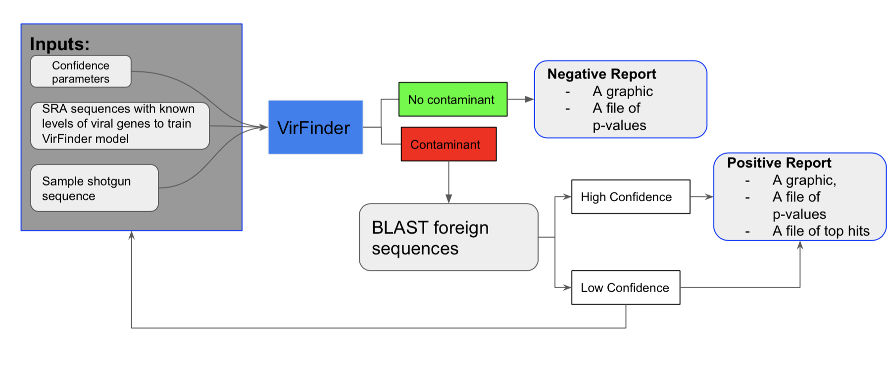
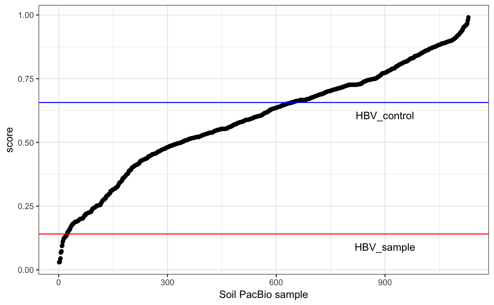

# VirusAlert

Discovery and validation of viruses using long read technology

Goal: To find viruses, both novel and known, in PacBio generated long read metagenomic data in order to find and diagnose viral infections in cultured cell.

Methods: Validation of viral presence using VirFinder is followed by use of BLASTn to determin the orgin family of virus.


Bioreactor Use
-------------
VirusAlert is intended to be used to analyze cell cultures used pharma bioractors to periodically check for viral infection.
By running clean cell cultures through LRV, users can set a baseline p-value for their specific cell line. Extreme deviations along with BLAST analysis of 'contaminent' contigs can indicate viral infection and need for further investigation.

 
 Workflow
 -------
 

VirFinder
---------
At the heart of VirusAlert is VirFinder. A k-mer based virus detection software that implements machine learning to allow users to isolate viral reads from host reads. VirFinder is, by default, trained on viral sequences from a 2014 viral sequence database. VirFinder then uses machine learning algorithms to find possible viral k-mers within the reads. Based on the training data and inputs, VirFinder outputs possible viral reads and p-values between 0 and 1; 1 means there is no virus, 0 means there is virus. These p-values are then compared against the user inputed threshold value to determine if there is enough data to assume if virus is present. 

 GitHub: https://github.com/jessieren/VirFinder

 NCBI: https://www.ncbi.nlm.nih.gov/pubmed/28683828
 
BLASTn
-----
The found viral sequences that the viral k-mers originated from are then run using BLASTn to find possible viral matches in the viral RefSeq database. This information is then returned to the user in a BLAST report detailing the suspected family of any reads that are determined to be viral in origin.
 

Install
-------

1) First, clone the repository:

    git clone https://github.com/NCBI-Hackathons/LongReadViruses.git

Next, run the top-level [install.sh][1] script.

This will install dependencies in the tools directory, and test data files in the data directory.

Usage
-----

Run [virusalert.py][2]. 

[1]: install.sh
[2]: virusalert.py.py
[3]: usage.txt


Command Line Options for virusalert.py:
```
virusalert.py -X
-h|--help  Print this help text. ---

-v         Print debugging information. [default: true]

-i INPUTS  One or more SRR numbers or fastq/a file paths as input,
           e.g. SRR5150787 or testfile.fq [default: SRR5150787]
           
-t INTYPE  Type of input provided - can be either srr, fasta or fastq
           [default: srr]
           
          
-c CONTDB  Contamination database to use. Default is to download and
           install the RefSeq viral database.
           
-o OUTDIR  Working directory and where to save results [default: analysis]
```

Inputs
------
Sequence SRR: All data passed into used in VirusAlert should be long read PacBio shotgun sequences and passed in the form of a SRA Run Accession (SRR).

Threshold [Optional] : minimum P-value for a non contaminated output

Sample Output
------------
 
 

Citations
---------
VirFinder:
Ren J, Ahlgren NA, Lu YY, Fuhrman JA, Sun F. VirFinder: a novel k-mer based tool for identifying viral sequences from assembled metagenomic data. Microbiome. 2017;5:69.


